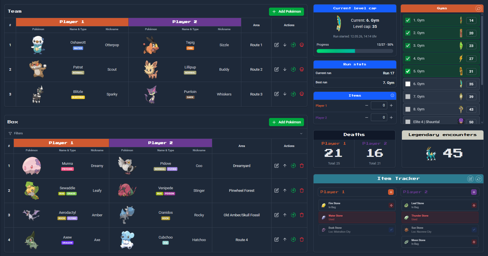
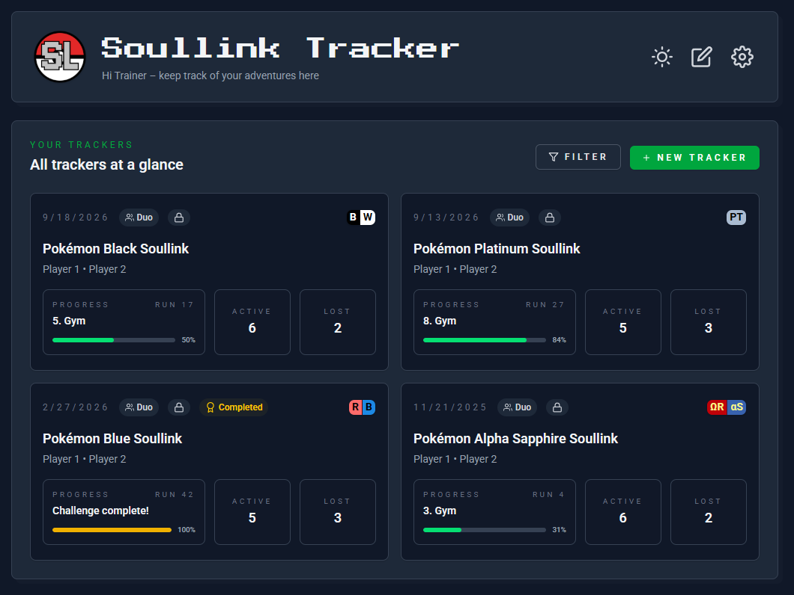
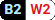

<p align="center">
  
</p>

<h1 align="center">Soullink Tracker</h1>

<p align="center">
  <b>A real-time collaborative Soullink &amp; Nuzlocke Tracker - built for streamers, friend groups, and challenge runners.</b>
</p>

<p align="center">
  <a href="https://github.com/joos-too/pokemon-soullink-tracker/releases"></a>&nbsp;
  &nbsp;
  <a href="https://github.com/joos-too/pokemon-soullink-tracker/issues"></a>&nbsp;
  <a href="https://github.com/joos-too/pokemon-soullink-tracker/stargazers"></a>&nbsp;
  <a href="https://github.com/joos-too/pokemon-soullink-tracker/graphs/contributors"></a>&nbsp;
</p>

<p align="center">
  
  &nbsp;
  
</p>

---

## What is Soullink Tracker?

Soullink Tracker is an open-source web app for managing Pokémon **Soullink** and **Nuzlocke** runs. You can track your links/catches, cleared routes, progression, and items. It also syncs the tracker state in real time between all players, so everyone always sees the same state of team, box, progression... - no spreadsheets, no Discord copy-pasting or constant streaming.

Whether you're streaming a duo Soullink, running a solo Nuzlocke, or coordinating a trio challenge with friends, this tracker helps you manage your entire run.

---

## ✨ Features

- **Pokémon linking** - Directly pair Pokémon links and add the catch area
- **Progression tracking** - Badges/Gyms, Rival battles, and Elite Four, all with provided level caps
- **Evolution tracking** - Evolve linked Pokémon and keep links in sync
- **Item tracking** - Track your Fossils, Evolution stones, Mega stones, and other items. Reviving a fossil automatically creates a new link
- **Version-awareness** - Pokémon, Routes, and Items are filtered and autocompleted by the game version you're playing
- **Team management** - Filter and sort your links by type to find the best links for your active team
- **Solo, Duo & Trio** - The Tracker supports Solo-Nuzlocking, up to Trio-Soullink
- **Custom rulesets** - Use built-in presets or create and save your own rules
- **Public / read-only mode** - Share your tracker with stream viewers or guests, enabling them to inspect your progress
- **Real-time collaboration** - All players see changes instantly, making it very easy to coordinate runs and build your team
- **Localization** - Full English and German support

---

## 🎮 Supported Versions

The tracker provides **pre-filled level caps and rival battle data** for all mainline games up to Generation 6. Newer generations introduced non-gym progression (trials, challenges), so they aren't included as presets - but you can still enable all Pokémon and Items from newer generations in Custom Trackers.

<details>
<summary><b>Version overview</b></summary>

| Generation | Versions                                                                                                                                                          |
| ---------- | ----------------------------------------------------------------------------------------------------------------------------------------------------------------- |
| **Gen 1**  |                                                                |
| **Gen 2**  |                                                            |
| **Gen 3**  |    |
| **Gen 4**  |     |
| **Gen 5**  |                                               |
| **Gen 6**  |                                                                 |
| **Gen 7+** | Custom Trackers                                                                                                                                                   |

</details>

### Custom Trackers

All Pokémon and items from Gen 7+ are available when you select **Custom Tracker** - perfect for ROM hacks, or fan games, which add newer Pokémon to older game version.

---

## 🛠 Tech Stack

| Layer        | Technology                                           |
| ------------ | ---------------------------------------------------- |
| **Frontend** | React 19 · TypeScript · Tailwind CSS                 |
| **Build**    | Vite                                                 |
| **Backend**  | Firebase Authentication · Firebase Realtime Database |
| **Data**     | PokéAPI · PokéWiki                                   |

---

## 🚀 Getting Started

```bash
git clone https://github.com/joos-too/pokemon-soullink-tracker.git
cd pokemon-soullink-tracker
npm install
cp .env.example .env
npm run emulators   # terminal 1
npm run dev          # terminal 2
```

For the full setup guide, environment config, deployment instructions, and architecture details, check out the **[Contributing Guide](CONTRIBUTING.md)**.

---

## 🤝 Contributing

Contributions are welcome! Check out the **[Contributing Guide](CONTRIBUTING.md)** for everything you need - local setup, architecture overview, coding conventions, and how to submit a pull request.

_Have an idea or found a bug? [Open an issue!](https://github.com/joos-too/pokemon-soullink-tracker/issues)_

---

## 📝 Credits & Acknowledgments

| Resource                                              | Usage                                          |
| ----------------------------------------------------- | ---------------------------------------------- |
| [PokéAPI](https://pokeapi.co/)                        | Pokémon data (types, evolution chains/methods) |
| [PokéWiki](https://www.pokewiki.de/)                  | Item version info, Item & rival sprites        |
| [PokeAPI Sprites](https://github.com/PokeAPI/sprites) | Pokémon & badge sprites                        |

---

<p align="center">
  <sub>Pokémon and all related names are trademarks of Nintendo / Creatures Inc. / GAME FREAK Inc.<br>This project is a fan-made tool and is not affiliated with or endorsed by any of these companies.</sub>
</p>
